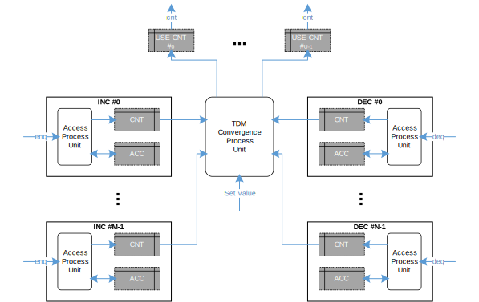

- [Multi Access Counter System](#multi-access-counter-system)

# Multi Access Counter System

其中：
- 每个访问源设置2个TP Memory
  - 一个ACC TP用于记录访问counter变化量
  - 一个CNT TP用于汇聚层访问
- 设置全局汇聚处理模块
  - TDM遍历每个counter单元
  - 每次从所有访问源的CNT TP中读取